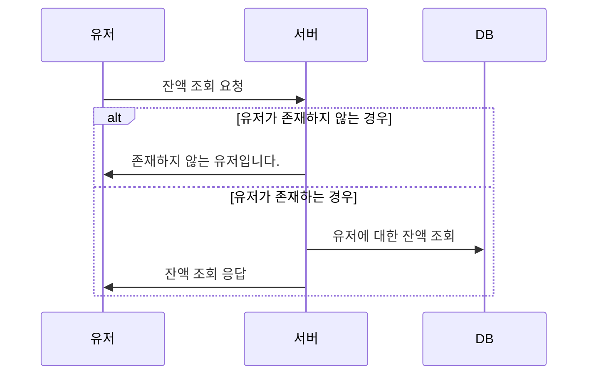
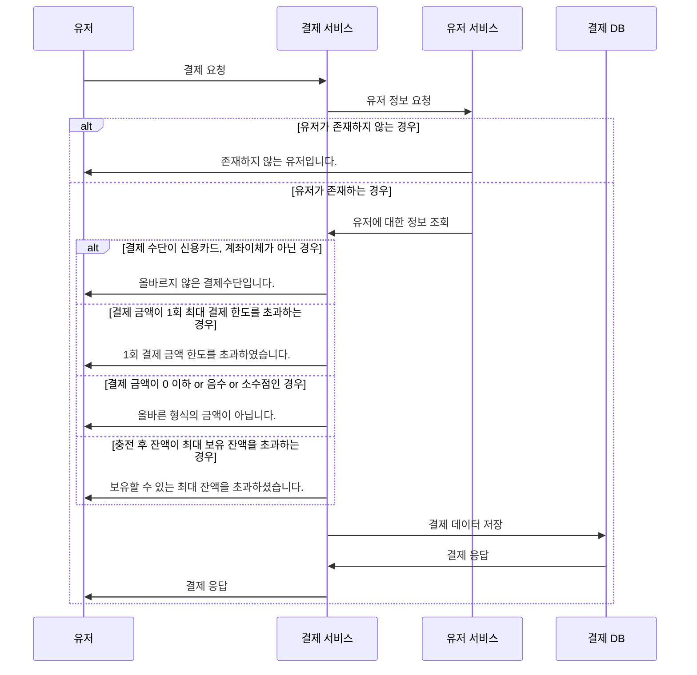
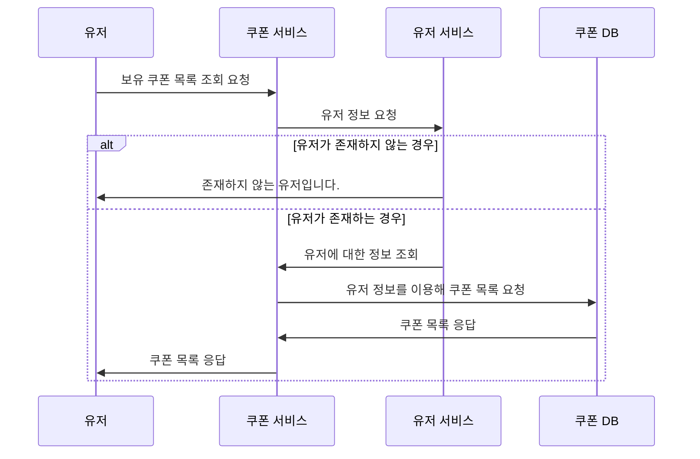
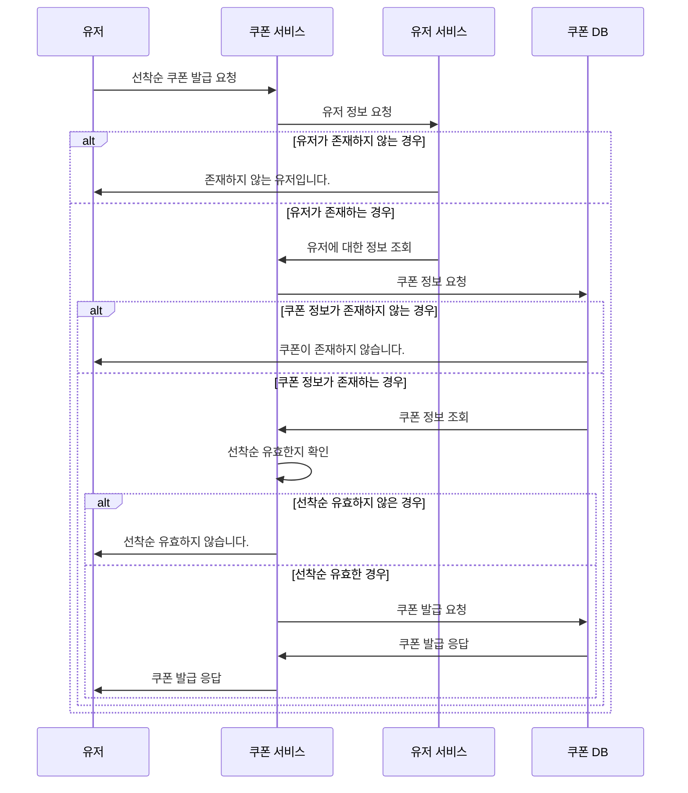
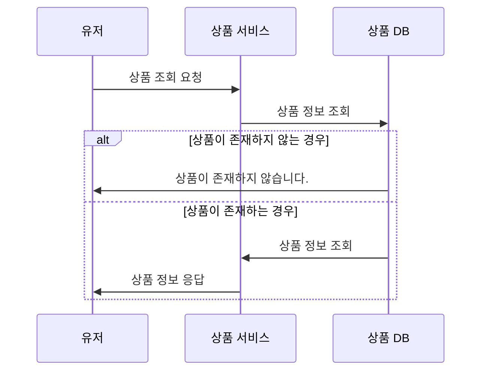
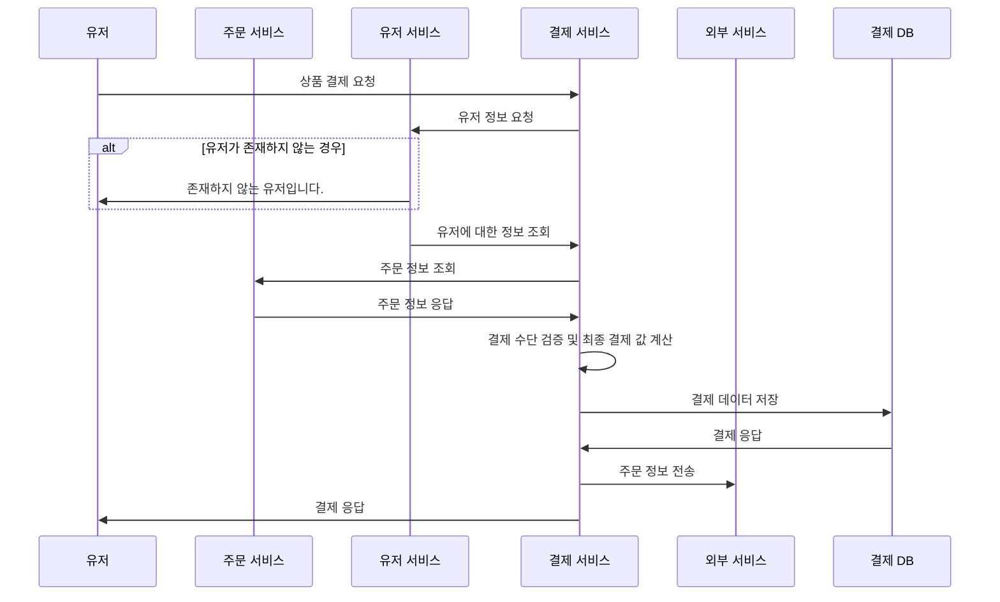
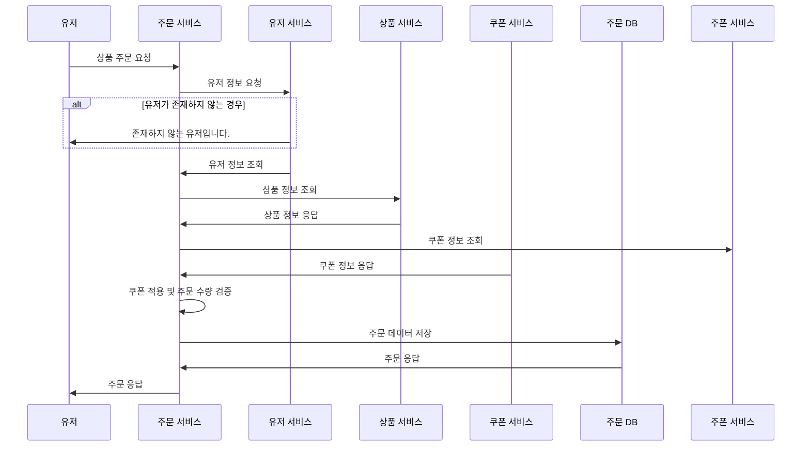
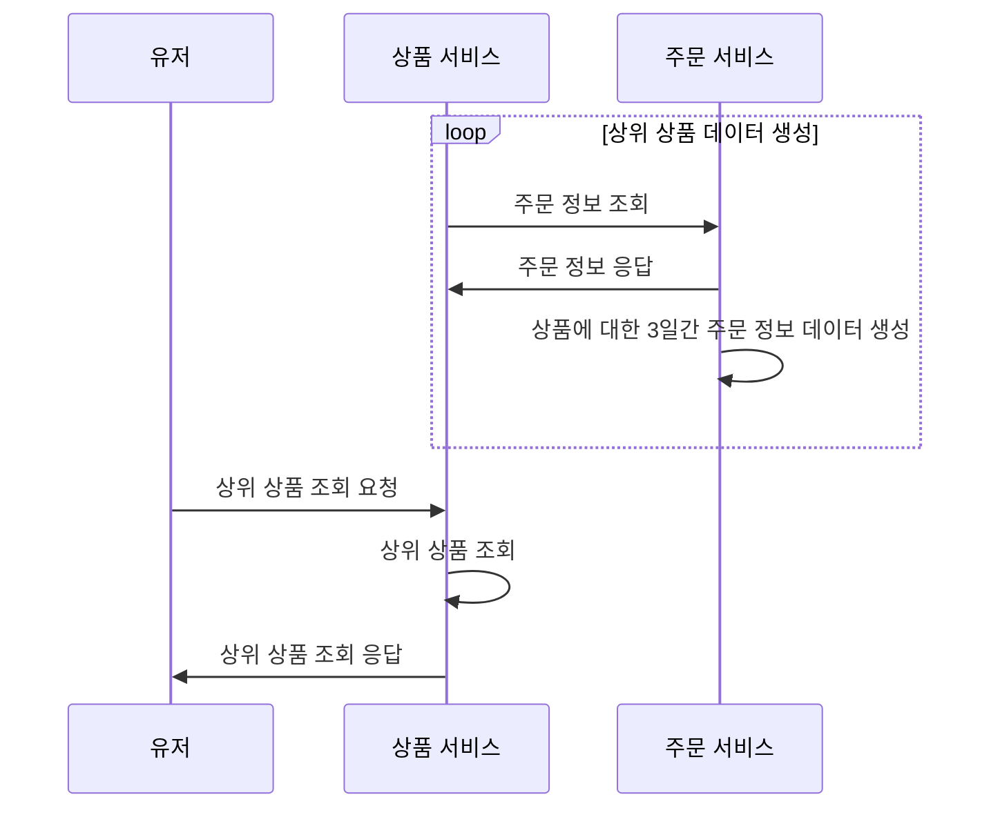

# E-Commerce

## 마일스톤
- 링크: https://docs.google.com/spreadsheets/d/1AoTCf-ci0pSb1YV-3ZUueVK0tHVjIhNj6dZVdVwsu7Q/edit?gid=1115838130#gid=1115838130

## 요구사항 분석
```js
참고 사항

- 대부분의 기능에 대해 유저에 대한 권한 검사가 필요하지만 해당 주차의 목적과는 부합하지 않기 때문에 권한 관련은 모두 제외

-----------------------------------------------------------------------------
# 잔액 충전 API

[기능 정의]
- 결제에 사용될 금액을 충전하는 API 를 작성합니다.
- 사용자 식별자 및 충전할 금액을 받아 잔액을 충전합니다.
- 한 번 충전시 최대 한도는 100만원으로 지정합니다. (수정 가능성 높다.)
- 충전 수단은 신용카드, 계좌이체만 지원한다.
- 최대 보유 잔액은 1,000,000,000 이다.

[Edge Case 정리]
- 0 or 음수 or 소수점 수로 포인트를 충전할 경우 "올바른 형시의 금액이 아닙니다." 예외 return
- 같은 사용자가 동시에 두 번 이상 충전할 경우 한 번만 충전되어야 한다. (정상적인 상황에선 동시에 두 번 충전될 일이 없기 때문)
- 한 번 충전에 최대 한도(100만원)을 넘기는 경우 "1회 최대 충전 한도를 초과하셨습니다." 예외 return
- 신용카드, 계좌이체 이외의 충전 수단은 "올바르지 않은 충전수단입니다." 예외 return
- 잔액 충전 시 최대 보유 잔액을 넘기는 경우 "보유할 수 있는 최대 잔액을 초과하셨습니다". 예외 return
- 존재하지 않는 사용자의 잔액 충전 시 "존재하지 않는 사용자입니다." 예외 return

# 잔액 조회 API

[기능 정의]
- 사용자 식별자를 통해 해당 사용자의 잔액을 조회합니다.

[Edge Case 정리]
- 존재하지 않는 사용자의 잔액 조회 시 "존재하지 않는 사용자입니다." 예외 return

------------------------------------------------------------------------------
# 보유 쿠폰 목록 조회 API

[기능 정의]
- 현재 사용자가 가지고 있는 쿠폰에 대한 정보를 보여줍니다.
	- 출력 정보: 쿠폰 명, 사용 기간, 현재 사용 가능 여부, 사용했을 경우 사용 시점 

[Edge Case 정리]
- 존재하지 않는 사용자의 보유 쿠폰 목록 조회 시 "존재하지 않는 사용자입니다." 예외 return


# 선착순 쿠폰 발급 API

[기능 정의]
- 사용자는 선착순으로 할인 쿠폰을 발급받을 수 있습니다.
- 동일한 쿠폰에 대해 한 사람당 한 번 쿠폰을 발급받을 수 있다.

[Edge Case 정리]
- 선착순 30명일 때, 동시에 40명이 쿠폰 발급을 원할 경우 정확히 30명만 발급해야 한다.
- 한 쿠폰에 대해 동일한 사용자가 동시에 두 번 이상 쿠폰 발급을 요청할 경우 한 번만 발급해야 한다. (선착순이 유효할 경우) 

----------------------------------------------------------------------------
# 상품 조회 API

[기능 정의]
- 상품 정보 ( ID, 이름, 가격, 잔여수량 ) 을 조회하는 API 를 작성합니다.
- 조회시점의 상품별 잔여수량이 정확하면 좋습니다.

[Edge Case 정리]
- 존재하지 않는 상품에 대해 조회 시 "존재하지 않는 상품입니다." 예외 return


# 상품 결제 API

[기능 정의]
- 주문 받은 상품에 대한 결제를 진행하는 API를 작성합니다.
- 결제는 기 충전된 잔액을 기반으로 수행하며 성공할 시 잔액을 차감해야 합니다.
- 결제 수단은 신용카드, 계죄이체만 제공합니다.
- 1회 최대 결제 한도는 1,000,000,000입니다.
- 데이터 분석을 위해 결제 성공 시에 실시간으로 주문 정보를 데이터 플랫폼에 전송해야 합니다. ( 데이터 플랫폼이 어플리케이션 `외부` 라는 가정만 지켜 작업해 주시면 됩니다 )

[Edge Case 정리]
- 하나의 주문에 대해 결제 요청이 동시에 두번 요청이 올 경우 한 번만 결제되어야 합니다.
- 제공되는 결제 수단 이외의 다른 결제 수단에 대해서는 "올바르지 않은 결제수단입니다." 예외 return
- 결제 금액이 1회 최대 결제 한도를 초과할 경우 "1회 결제 금액 한도를 초과하였습니다." 예외 return


# 상품 주문 API

[기능 정의]
- 사용자 식별자와 (상품 ID, 수량) 목록을 입력받아 주문하는 API를 작성합니다.
- 주문 시에 유효한 할인 쿠폰을 함께 제출하면, 전체 주문금액에 대해 할인 혜택을 부여받을 수 있습니다.
- 주문을 취소할 경우 해당 수량이 주문 전으로 돌아와야 합나디ㅏ.

[Edge Case 정리]
- 하나의 상품에 대해 재고가 20개일 경우 30개의 주문(수량 1개)이 동시에 오면 20개의 주문만 성공하고 나머지는 실패해야 합니다.
- 하나의 상품에 대해 유저  A, B가 동시에 2개, 3개 상품을 주문한 경우, 정확히 현재 재고에 -5가 차감되어야 합니다.
- 주문 수량이 0개 or 음수인 경우 "잘못된 주문 요청입니다." 예외 return

------------------------------------------------------------------------------
# 상위 상품 조회 API

[기능 정의]
- 최근 3일간 가장 많이 팔린 상위 5개 상품 정보를 제공하는 API 를 작성합니다.
- 여기서 최근 3일이란 조회 시점부터 -72시간을 의미
- 많이 팔렸다라는 의미 "금액이 아닌 갯수"가 많이 팔렸다는 의미이다.
- 해당 기능은 실시간성이 중요하다.

[Edge Case 정리]
- 동률일 경우 총 판매 금액 > 상품 등록일 순으로 우선 순위를 차지한다.

```

## 시퀀스 다이어그램

### 잔액 조회


### 잔액 충전


### 보유 쿠폰 목록 조회


### 선착순 쿠폰 발급


### 상품 조회


### 상품 결제


### 상품 주문


### 상위 상품 조회

